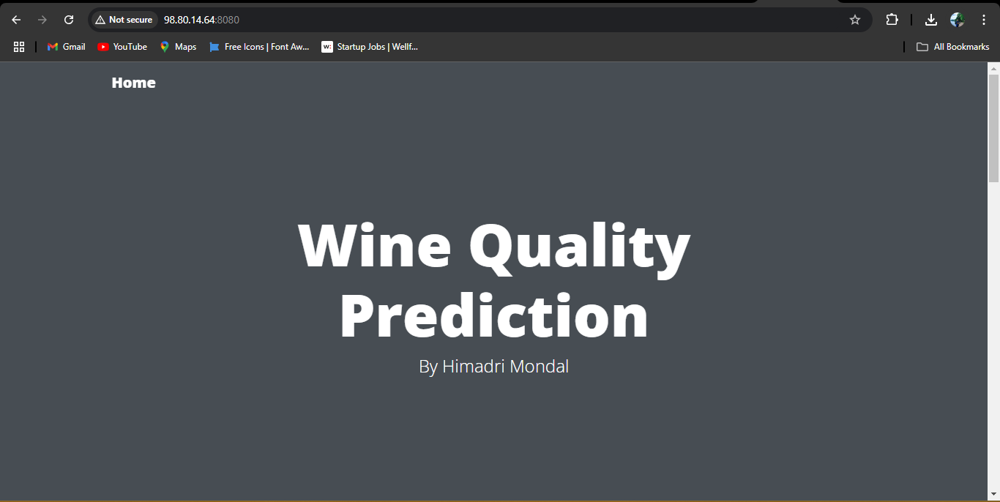
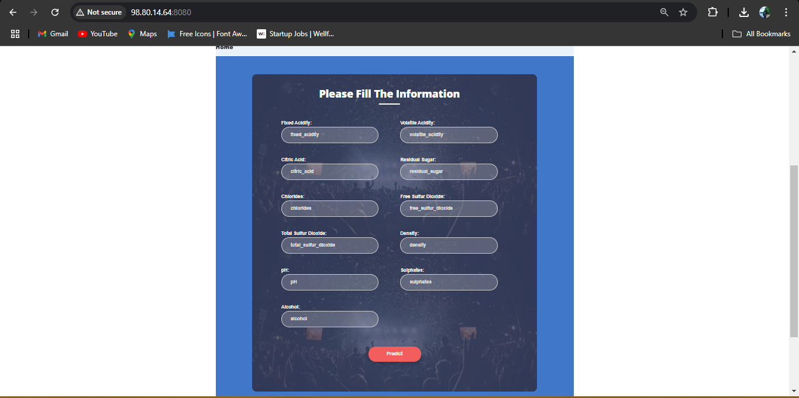
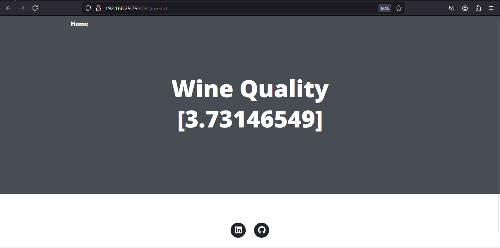

# End-to-end-Machine-Learning-Project-with-MLflow

This project predicts wine quality based on various chemical properties using machine learning techniques. It focuses on creating structured, modular, and object-oriented Python code with seamless deployment pipelines. The project also incorporates MLflow for experiment tracking, CI/CD, Flask for a web application, MLOps , and deployment on AWS.

## Project Goal

- **Demonstrate**: Structured and modular code organization
- **Use**: Python, MLflow, Flask, CI/CD, and AWS
- **Build**: An end-to-end machine learning pipeline from data ingestion to deployment

## Project Overview

### 1. First Page


### 2. Form to Take Information


### 3. Result Page


## Project Structure and Process

The project is divided into multiple stages, with each component being modular and reusable. Below is a summary of the main stages:

### 1. Folder Template Creation
   - Organizes project structure with directories for data, scripts, logs, model artifacts, and documentation.

### 2. Environment Setup & Requirements Installation
   - Sets up the virtual environment and installs dependencies listed in `requirements.txt`.

### 3. Logger & Utilities Setup
   - Establishes a custom logger to track activities and errors.
   - Implements reusable utility functions for data processing, error handling, and configuration management.

### 4. Data Ingestion
   - Loads data from a reliable source, cleans, and stores it in the project directory.
   - Splits data into training and test sets for the modeling stage.

### 5. Data Validation
   - Checks for data integrity and ensures there are no anomalies or missing values.

### 6. Data Transformation
   - Processes data, including feature scaling and encoding, to prepare it for training.

### 7. Model Training
   - Trains machine learning models using scikit-learn and tunes hyperparameters.
   - Tracks all experiments, models, and metrics with MLflow.

### 8. MLflow Experiment Tracking
   - Logs experiments, tracks model parameters, and stores results using MLflow for reproducibility.

### 9. Prediction Pipeline
   - Creates an end-to-end pipeline that loads a trained model and predicts wine quality for new inputs.

### 10. Flask Web App
   - Develops a user-friendly Flask web interface to interact with the prediction pipeline.

### 11. CI/CD Pipeline
   - Implements CI/CD using GitHub Actions or any other preferred CI/CD tool.
   - Tests, builds, and deploys the model to ensure a streamlined development workflow.

### 12. AWS Deployment
   - Deploys the Flask web application on AWS EC2 for scalability and production use.

## Workflows

1. Update config.yaml
2. Update schema.yaml
3. Update params.yaml
4. Update the entity
5. Update the configuration manager in src config
6. Update the components
7. Update the pipeline 
8. Update the main.py
9. Update the app.py


# How to run?
### STEPS:

Clone the repository

```bash
https://github.com/himadri-09/End-to-End-ML-project-with-MLflow
```
### STEP 01- Create a conda environment after opening the repository

```bash
conda create -n abc python=3.8 -y
```

```bash
conda activate abc
```


### STEP 02- install the requirements
```bash
pip install -r requirements.txt
```


```bash
# Finally run the following command
python app.py
```

Now,
```bash
open up you local host and port
```


## MLflow

[Documentation](https://mlflow.org/docs/latest/index.html)


##### cmd
- mlflow ui


# AWS-CICD-Deployment-with-Github-Actions

## 1. Login to AWS console.

## 2. Create IAM user for deployment

	#with specific access

	1. EC2 access : It is virtual machine

	2. ECR: Elastic Container registry to save your docker image in aws


	#Description: About the deployment

	1. Build docker image of the source code

	2. Push your docker image to ECR

	3. Launch Your EC2 

	4. Pull Your image from ECR in EC2

	5. Lauch your docker image in EC2

	#Policy:

	1. AmazonEC2ContainerRegistryFullAccess

	2. AmazonEC2FullAccess

	
## 3. Create ECR repo to store/save docker image
    - Save the URI: your aws ecr repo uri

	
## 4. Create EC2 machine (Ubuntu) 

## 5. Open EC2 and Install docker in EC2 Machine:
	
	
	#optinal

	sudo apt-get update -y

	sudo apt-get upgrade
	
	#required

	curl -fsSL https://get.docker.com -o get-docker.sh

	sudo sh get-docker.sh

	sudo usermod -aG docker ubuntu

	newgrp docker
	
# 6. Configure EC2 as self-hosted runner:
    setting>actions>runner>new self hosted runner> choose os> then run command one by one


# 7. Setup github secrets:

    AWS_ACCESS_KEY_ID=

    AWS_SECRET_ACCESS_KEY=

    AWS_REGION = us-east-1

    AWS_ECR_LOGIN_URI = demo>>  your aws ecr repo uri

    ECR_REPOSITORY_NAME = ecr repo name


## About MLflow 
MLflow

 - Its Production Grade
 - Trace all of your expriements
 - Logging & tagging your model


